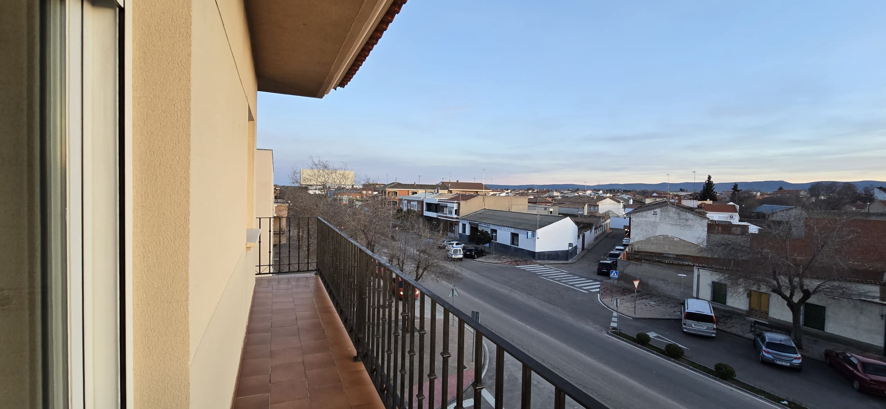
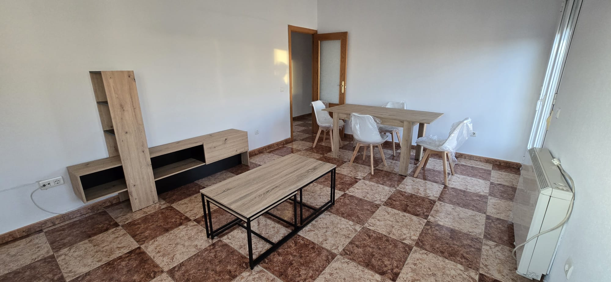
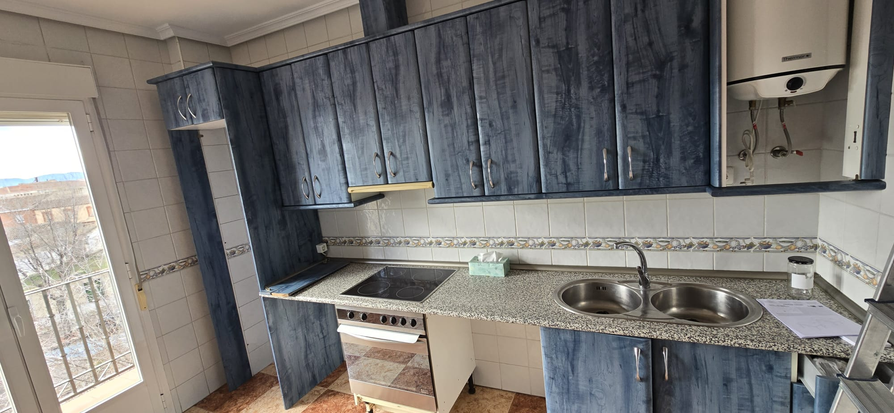
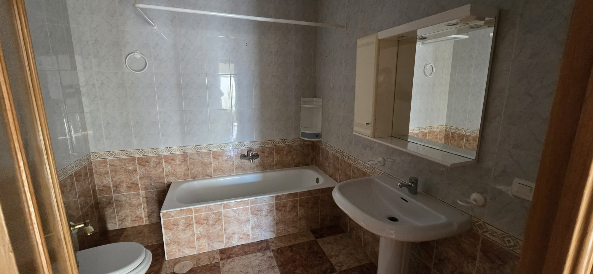
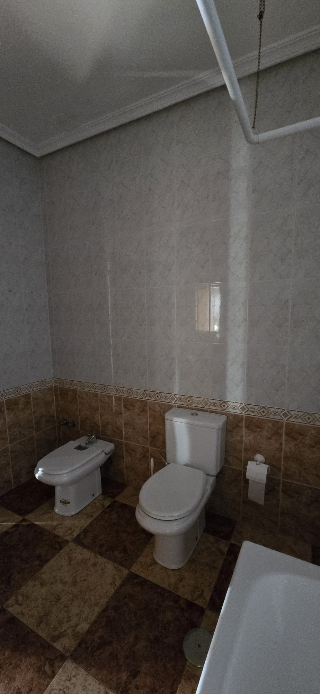
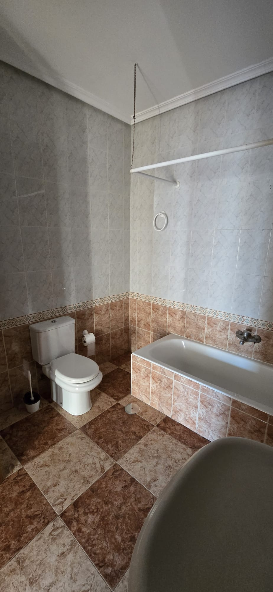

# Fotos del Piso en Sonseca

¡Bienvenidos a la galería de fotos del piso en Sonseca! Aquí podrás ver imágenes detalladas de cada rincón de este acogedor hogar.

## Descripción del Piso

Este encantador piso cuenta con una habitación con cama de matrimonio, ideal para descansar plácidamente. El baño es amplio y está equipado con una bañera perfecta para relajarse después de un largo día.

Disfruta de las vistas a la montaña desde la terraza en esquina, un lugar perfecto para tomar el sol o disfrutar de una taza de café por la mañana. Además, el piso incluye un patio interior que puede utilizarse como despensa, proporcionando un espacio adicional para almacenamiento.

Para aquellos que trabajan desde casa, hay una habitación que funciona como despacho y está equipada con un cómodo sofá cama. El salón y la cocina son espaciosos y acogedores, ideales para reuniones familiares o con amigos. Cabe destacar que todos los muebles son nuevos, excepto los de la cocina, que mantienen un toque clásico y funcional.

¡Esperamos que disfrutes de las fotos y te animes a visitar este maravilloso piso en Sonseca!

## Galería de Fotos

### Terraza

### Salón

### Cocina

### Baño

### Habitación Principal

### Patio Interior

### Despacho

### Pasillo
