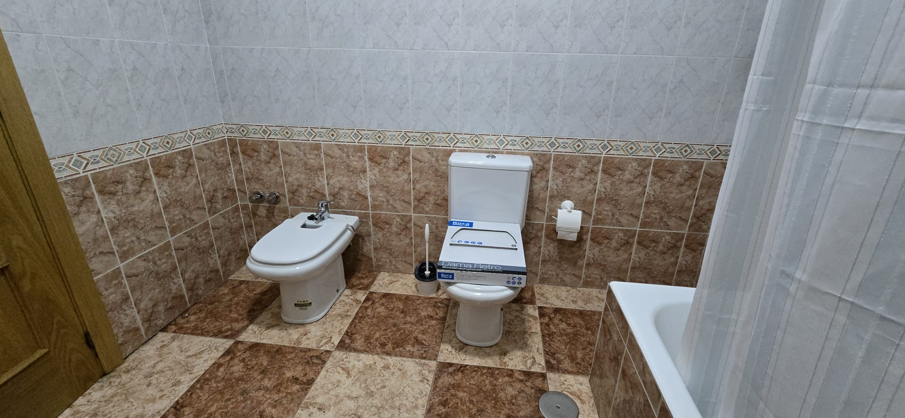

# Fotos del Piso en Sonseca

¡Bienvenidos a la galería de fotos del piso en Sonseca! Aquí podrás ver imágenes detalladas de cada rincón de este acogedor hogar.

## Descripción del Piso

Este encantador piso cuenta con una habitación con cama de matrimonio, ideal para descansar plácidamente. El baño es amplio y está equipado con una bañera perfecta para relajarse después de un largo día.

Disfruta de las vistas a la montaña desde la terraza en esquina, un lugar perfecto para tomar el sol o disfrutar de una taza de café por la mañana. Además, el piso incluye un patio interior que puede utilizarse como despensa, proporcionando un espacio adicional para almacenamiento.

Para aquellos que trabajan desde casa, hay una habitación que funciona como despacho y está equipada con un cómodo sofá cama. El salón y la cocina son espaciosos y acogedores, ideales para reuniones familiares o con amigos. Cabe destacar que todos los muebles son nuevos, excepto los de la cocina, que mantienen un toque clásico y funcional.

¡Esperamos que disfrutes de las fotos y te animes a visitar este maravilloso piso en Sonseca!

## Galería de Fotos

### Terraza

### Salón

**¿Qué hay en el salón?**
Las fotos del salón no están actualizadas, ya que falta incluir el sofá chaise longue y si fuese necesario la televisión.

### Cocina

<!--  -->
<!--  -->

**¿Qué hay en la cocina?**
Las fotos de la cocina no están actualizadas, ya que falta incluir el frigorífico, la lavadora y el lavavajillas.

### Baño

### Habitación Principal
<!--  -->

**¿Qué hay en la habitación principal?**
La habitación principal cuenta con un colchón sin estrenar y dos almohadas individuales de diferentes conforts: una dura y otra blanda, para que puedas elegir la que mejor se adapte a tus necesidades. Cabe mencionar que las fotos no están actualizadas, ya que falta añadir una imagen del armario y un espejo grande que tiene, además de las barras de las cortinas.

### Patio Interior

### Despacho
<!--  -->

**¿Qué hay en el despacho?**
El despacho está equipado con un cómodo sofá cama, ideal para momentos puntuales de visitas. Si fuera muy necesario, se podría convertir en otra habitación para compartir el piso, añadiendo una cama de 90 cm.

### Pasillo

### Ascensor

### Garaje

### Trastero
